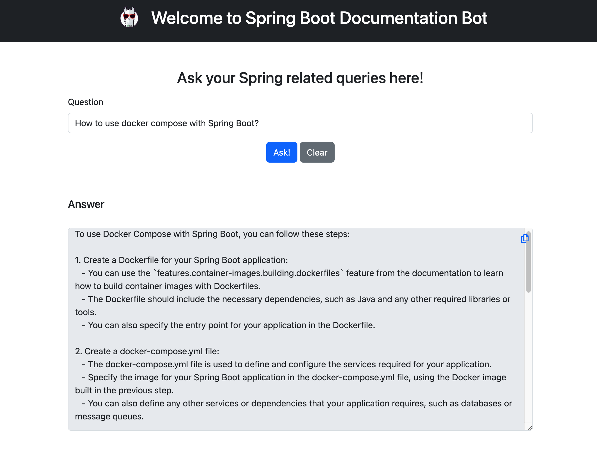

<div style="display: flex; align-items: center; justify-content: center; margin: auto;">
  
  <h1>Spring Boot Documentation Bot</h1>
</div>

# 🌐 Description

> This repository contains a documentation bot powered by a large language model (LLM) using LangChain4j to quickly find answers to your Spring Boot questions. It allows easy browsing of Spring documentation and leverages retrieve and gather (RAG) to extract relevant details on demand. The bot is built with Spring Boot and uses LangChain4j to ingest Spring documentation URLs into the model for enhanced question answering about Spring frameworks and the overall Spring ecosystem.

## 📚 Table of Contents

- [Prerequisites](#-prerequisites)
- [Installing](#-installing)
- [Built With](#-built-with)
- [License](#-license)
- [Support](#-support)
- [Application Screenshot](#-application-screenshot)

### 📋 Prerequisites

- Java 20
- Maven
- API keys for [Open API](https://platform.openai.com/)

### 🔧 Installing

1. Clone the repository on your local machine.
    ```shell
    git clone https://github.com/miliariadnane/spring-boot-doc-rag-bot
    cd spring-boot-doc-rag-bot
    ```
2. Open the `application.yml` file and replace `OPEN_API_KEY` with your own Open API key. For demo purposes, you can use the key "demo".

3. Build the project.
    ```shell
    mvn clean install
    ```
4. Run your Spring Boot application.
    ```shell
    mvn spring-boot:run

## 🛠️ Built With

- [Spring Boot](https://spring.io/projects/spring-boot) - The web framework used
- [Maven](https://maven.apache.org/) - Dependency Management
- [LangChain4j](https://github.com/langchain4j) - Used for integration of AI/LLM models into Java applications

## 📝 License

This project is licensed under the MIT License - see the [LICENSE.md](LICENSE.md) file for details

## 🌟 Support

> If you find this project useful or interesting, please consider giving it a star ⭐ on GitHub. Your support is greatly appreciated!
> Also, if you have a moment, don't forget to make a duaa 🤲 for me and my parents. Thank you for your support!

## 📸 Application Screenshot


